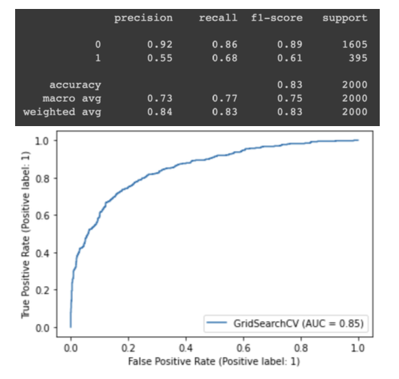
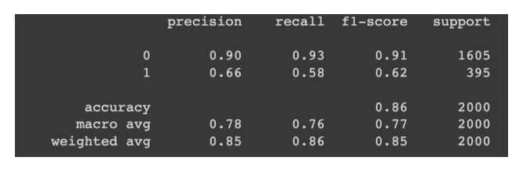
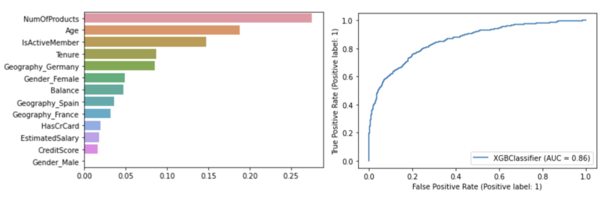

## Predicting churn in banking customers

Customer churn is an important metric for most businesses, losing customers almost always
equals loss of revenue, which is why it is important to prevent it. The problem lies in the fact
that it is uncertain why a customer would choose to leave and when. This project aims at
predicting when a customer might churn (leave) and suggest ways that could possibly prevent
this.

In a financial setting, like in banks, customer loyalty is of great concern, customers who leave
a bank are unlikely to recommend it to anybody causing a cascading loss of revenue.
However, they are unaware of issues a client is facing as they seldom ask for routine
customer feedback. To prevent losing a customer, data mining techniques can be applied on
existing customer data to find patterns such as existing trends within groups who choose to
stay with the bank vs. groups who leave. This knowledge can also be used to find answers to
questions such as:

- Are there aspects of customer service that can be improved to prevent this?

- Is there anything that can be done to decrease the overall exit rates of customers?
  
This project aims at finding the most data mining models to predict whether a customer
would leave a bank by classifying them based on other factors and provide insightful
solutions.

## Model Exploration

The problem that is being addressed is a supervised classification problem, there exist several
models that can be implemented. For the purpose of this project we are will be exploring the
following models -

Logistic Regression, Decision Tree, SVC, Random Forest, KNN, Gradient Boost, XGBoost
Classifier, LGBM Classifier, and Neural Networks

- LGBM and Neural Network gives the highest recall value which is the general goal for
customer churn tasks hence making them great models to use as well, however due to the
sheer number of iterations - 200 for LGBM and 300 for Neural Networks (even for this
relatively small dataset) it takes about 25 and 49 seconds respectively.

- XGB gives the highest accuracy with the highest f1 score, which is why it would be one of
the most useful models to use for this problem. It take noticeably less time to execute even
with the number of estimators being set to a 100. Time taken to execute this model was 2.2
seconds while that of gradient boost was 3.2 seconds and random forest was 1.7 seconds

## Outcome 

Although having high accuracy for any given a model is a great way to asses the probability
of successfully achieving our goal, the purpose of this project was not entirely focused on
model accuracy. We wanted to analyze the model performance on factors like recall and f1
score, see how changing certain aspects of our dataset, like scaling and correcting class
imbalance, would affect the results, as well as record how different model parameters would
change our results. At the core of this project is finding out reasons why a customer would
leave the banks’ services, a few important observation and solutions are as follows:

- 1 in 3 people in Germany exited while also having a higher balance (lucrative), hence
necessitating a look into competition in Germany - (what other bank are the customers a
part of?) and a look into whether services in Germany are somehow subpar

- Customers who have 1 or 2 products have mostly stayed as opposed to customers who use
3 or 4 products, this could be because these products are not as good and require
improvement and better customer service

- We see that active members have lesser chances of leaving hence it would be important to
keep the customers engaged, as well as maintain the interest of female customers
Customer retention is a factor that has many facets and does not improve overnight, however
if we keep up the interest of existing customers and find out reasons as to why customers are
leaving they can be reeled back in with a few solid strategies and improve customer loyalty.
